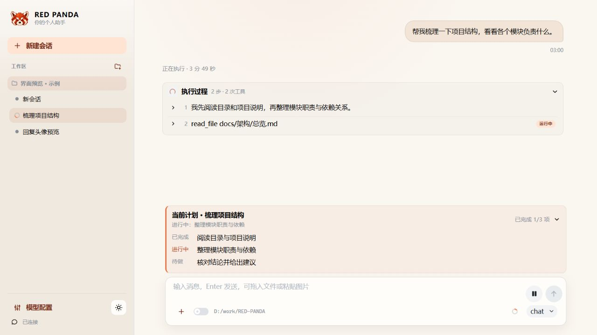

<p align="center">
  
</p>

<h1 align="center">RED PANDA</h1>

<p align="center">一个你可以拥有、理解并持续塑造的个人 AI 助手。</p>

<p align="center">
  <a href="#功能">功能</a> ·
  <a href="#快速开始">快速开始</a> ·
  <a href="#开发与测试">开发与测试</a> ·
  <a href="#文档">文档</a> ·
  <a href="#参与贡献">参与贡献</a>
</p>

RED PANDA 从对话出发，在你的工作区里阅读文件、修改内容、执行命令，并展示行动过程与工作计划。你可以连接远程模型或本地模型，通过 Web、终端或支持 ACP 的客户端使用它。

这个项目也记录了构建个人通用助手的学习过程：以模型负责判断，以明确的运行契约组织执行，让每项能力的行为、边界和变化都有据可查。项目仍在持续开发，欢迎一起讨论设计与实现。

## 功能

| 能力 | 当前支持 |
| --- | --- |
| 对话与工作区 | 多工作区、多会话、流式回复、图片与文件附件、消息编辑与会话分支 |
| 执行过程 | 文件读写、命令执行、工具进度与工作计划展示、命令授权与打断 |
| 模型选择 | DeepSeek、OpenAI、Qwen、StepFun、BigModel、vLLM、Ollama；候选模型配置与会话内切换 |
| 会话延续 | 事件持久化与重放、上下文整理（Compact）、工作区文件版本与显式回退 |
| 子任务 | 子会话独立调查或修改文件，父会话审阅差异并经授权合入 |
| 能力扩展 | 按需加载 MCP 工具、Skill 与 CLI 能力；一次性定时唤醒 |
| 使用入口 | Web 界面、终端交互、ACP stdio 接入；Web 支持浅色与深色外观 |

<p align="center">
  
  <br>
  <sub>Web 界面示例，使用演示数据。</sub>
</p>

## 快速开始

### 1. 准备环境与获取项目

需要 Git、[ripgrep](https://github.com/BurntSushi/ripgrep#installation)，以及一个可用的模型来源。Web 还需要 Node.js 与 npm，当前前端依赖支持 Node.js 22.x（至少 22.13）或 24.x。

安装脚本会下载项目专用的 Python 3.13 并安装依赖，不需要预装 Python 或 Docker。

此分支的工作区文件执行与回退采用内置 VFS，已在 Windows x64 与 Linux 上运行。启动前需要构建原生沙箱：Windows 安装 WinFsp，Linux 安装 FUSE 用户态组件。macOS 的文件视图尚未实现。

```sh
git clone https://github.com/firetoweak/RED-PANDA.git
cd RED-PANDA
```

### 2. 安装 Python 环境

在仓库根目录运行对应平台的脚本：

**Windows（PowerShell）**

```powershell
powershell -ExecutionPolicy Bypass -File .\scripts\setup.ps1
```

**macOS / Linux**

```sh
sh scripts/setup.sh
```

脚本会创建项目内的 `redpanda-env` 环境，并在个人数据目录 `~/.redpanda` 创建 `config.json` 与 `connections.json`；已有的个人配置不会被覆盖。Windows 下，默认个人数据目录位于用户主目录的 `.redpanda` 文件夹。

### 3. 配置模型连接

打开 `~/.redpanda/connections.json`，填写所用供应商的 `api_key`。文件包含所有内置供应商的配置项，只需修改你要使用的项，其余配置保留即可。

远程模型支持 DeepSeek、OpenAI、阿里云百炼 Qwen、阶跃星辰 StepFun 和智谱 BigModel。本地 vLLM / Ollama 填写包含 `/v1` 的 `base_url`；服务未启用认证时，密钥可以留空。

保存后，下一次模型调用直接使用新连接，无需重启。Web 可以在密钥未填写时启动，密钥由个人连接文件管理。完整示例与模型 ID 的填写方式见[模型配置指南](docs/模型配置.md)。

### 4. 构建原生沙箱和 Web

Windows 与 Linux 都要先构建原生沙箱。macOS 的文件视图尚未实现。VFS 源码随本仓库提供，无需另行克隆。Python 安装脚本不会安装 WinFsp、FUSE 或编译 Rust；缺少原生程序时文件工具会明确返回沙箱不可用。

**Windows**

先准备 Rust、WinFsp 驱动与 SDK、LLVM MinGW，再在仓库根目录执行：

```powershell
.\redpanda-env\Scripts\python.exe scripts/build_sandbox.py
```

默认构建 GNU LLVM（`x86_64-pc-windows-gnullvm`）release target；本机已验证的是同一 target 的 debug 构建。具体准备条件、可选参数与已验证的构建方式见 `scripts/build_sandbox.py`。

**Linux**

需要 rustup 提供的 `nightly-2026-08-07`（`native/sandbox/rust-toolchain.toml` 会选定它）以及 FUSE 用户态组件。编译不链接 libfuse。运行挂载需要 `fusermount3`，以及当前用户可读写的 `/dev/fuse`。

Ubuntu / Debian：

```sh
sudo apt-get update
sudo apt-get install -y fuse3 libfuse3-dev pkg-config build-essential
```

CentOS / RHEL / Fedora：

```sh
sudo dnf install -y fuse3 fuse3-devel pkgconf-pkg-config gcc
```

仍使用 yum 的发行版：

```sh
sudo yum install -y fuse3 fuse3-devel pkgconfig gcc
```

非特权挂载还需要：

- `/dev/fuse` 存在且当前用户可读写。`ls -l /dev/fuse` 常见为 `crw-rw-rw-`。若节点不存在，先加载模块：`sudo modprobe fuse`。若权限是 `crw-rw----` 且属组为 `fuse`，把用户加入该组并重新登录：`sudo usermod -aG fuse "$USER"`。
- `fusermount3` 随 `fuse3` 安装。普通用户通过它挂载，不需要 root。
- 沙箱自己的挂载不设置 `allow_other`，所以不需要改 `/etc/fuse.conf`。只有挂载点要给其他用户访问时，才取消该文件里 `user_allow_other` 的注释。

然后在仓库根目录执行：

```sh
./redpanda-env/bin/python scripts/build_sandbox.py
```

程序生成在 `redpanda/sandbox/bin/redpanda-sandbox`。`REDPANDA_SANDBOX_EXECUTABLE` 可指向其他构建。

然后安装前端依赖并构建：

```sh
cd web
npm ci
npm run build
cd ..
```

**Windows（PowerShell）**

```powershell
.\redpanda-env\Scripts\python.exe web_chat.py
```

**macOS / Linux**

```sh
./redpanda-env/bin/python web_chat.py
```

浏览器打开 [http://127.0.0.1:8765](http://127.0.0.1:8765)。在侧栏「模型配置」中添加你的服务实际支持的模型 ID，保存候选模型与新会话默认值；可以用「测试」按钮验证连接。

然后新建工作区，选择助手要使用的本地目录，再创建会话开始对话。输入区可切换会话模型，选择从下一次决策开始生效，已有历史保留。

### 其他入口与数据位置

下面的脚本同样使用 `redpanda-env` 中的 Python，在仓库根目录启动：

| 入口 | 用途 |
| --- | --- |
| `web_chat.py` | Web 服务；可用 `--port` 指定端口、`--workspace` 显式登记工作区 |
| `console_chat.py` | 终端交互；默认工作区为当前目录，可用 `--workspace` 指定 |
| `acp_chat.py` | 由支持 ACP 的客户端启动，通过 stdio 通信；可用 `--workspace` 指定工作区 |

个人配置与会话数据保存在 `~/.redpanda`。`REDPANDA_HOME` 可以更换整个个人数据目录，`REDPANDA_CONFIG` 可以单独指定模型候选配置文件；详细说明见[模型配置](docs/模型配置.md)。

## 开发与测试

Windows 与 Linux 的文件工具、命令和文件回退通过 VFS 文件视图执行。VFS 底层源码在 `native/vfs/`，Rust 沙箱应用在 `native/sandbox/`，Python 胶水源码在 `redpanda/sandbox/`，均由本仓库维护。Windows 安装 WinFsp 和构建工具后，Linux 安装上方的 FUSE 包后，执行 `python scripts/build_sandbox.py`；程序生成在 `redpanda/sandbox/bin/`，运行时默认使用它。构建条件及已验证的工具链见上方的构建说明。`REDPANDA_SANDBOX_EXECUTABLE` 仅用于显式选择其他构建。产品数据目录 `REDPANDA_HOME` 必须位于任务根之外。缺少原生程序时明确报错。macOS 尚未实现。

日常回退捕获助手造成的文件变化，`.gitignore` 不影响捕获。模型可选择保留用户后续值或恢复助手改变位置的原值；Web 时间旅行默认保留用户后续值。系统安装、挂载外命令写入及其他外部副作用不在回退范围内。子任务复制与成果比较、合入仍使用独立的 Git 业务端口，不参加日常 Step 记录。

本机接入、真实编码与回撤的验证结果，以及当前能力边界，见[Windows VFS 接入验证](docs/验证/VFS接入.md)。

完成安装与前端依赖准备后，可以用 Web 开发模式同时启动后端热重载与 Vite：

```powershell
# Windows
.\redpanda-env\Scripts\python.exe web_chat.py --dev
```

```sh
# macOS / Linux
./redpanda-env/bin/python web_chat.py --dev
```

打开终端打印的 Vite 地址。开发模式使用默认后端端口 `8765`。

运行后端测试前，先激活项目环境：Windows 使用 `.\redpanda-env\Scripts\Activate.ps1`，macOS / Linux 使用 `source redpanda-env/bin/activate`。日常反馈以默认测试为主，真实进程测试单独运行：

```sh
python -m pytest                 # 架构契约与进程内语义
python -m pytest -m process      # 真实进程、shell 与 MCP 传输
python -m pytest --all           # 默认测试 + 进程测试
```

真实模型测试需要配置可用连接并显式设置 `REDPANDA_RUN_LIVE_TESTS=1`，随后运行 `python -m pytest tests/live`；这些测试会调用实际模型服务。

前端测试与构建：

```sh
cd web
npm test
npm run build
```

## 文档

如果想理解项目，建议先读架构方向与总览，再按正在修改的能力查阅专题文档。

| 文档 | 内容 |
| --- | --- |
| [文档索引](docs/README.md) | 使用说明、架构专题与实验记录的入口 |
| [项目架构方向](docs/项目架构方向.md) | 个人助手的定位、渐进式加载与可控扩展原则 |
| [架构总览](docs/架构/总览.md) | 当前分层、包边界与测试分层 |
| [Runtime](docs/架构/运行/Runtime.md) | 运行事实、调度、持久化与恢复的核心契约 |
| [模型配置](docs/模型配置.md) | 连接文件、候选模型与会话模型切换 |
| [自举开发](docs/自举开发.md) | 用 RED PANDA 开发 RED PANDA，隔离工作区、数据与端口 |

`docs/架构/` 的目录划分也表达当前进度：`运行/`、`上下文/`、`能力/`、`入口/` 记录已落地的决策，`未开始/` 记录尚待探索的方向。长期记忆、交互式资源与进程沙箱等方向尚未实现，具体范围以文档和代码为准。

## 参与贡献

欢迎通过 [Issue](https://github.com/firetoweak/RED-PANDA/issues) 报告问题、交流使用体验或讨论设计，也欢迎提交 Pull Request。问题报告请带上运行环境、复现步骤、预期行为与实际结果。

修改前请阅读 [AGENTS.md](AGENTS.md) 与相关架构文档。保持高内聚、低耦合，让一次改动围绕一个明确问题展开；涉及架构边界或新增抽象时，先说明需求与取舍。测试放在 `tests/` 或前端对应测试位置，并在 PR 中写明验证方式与结果。

## 许可证

当前仓库尚未添加 `LICENSE`，开源许可证待确定。
